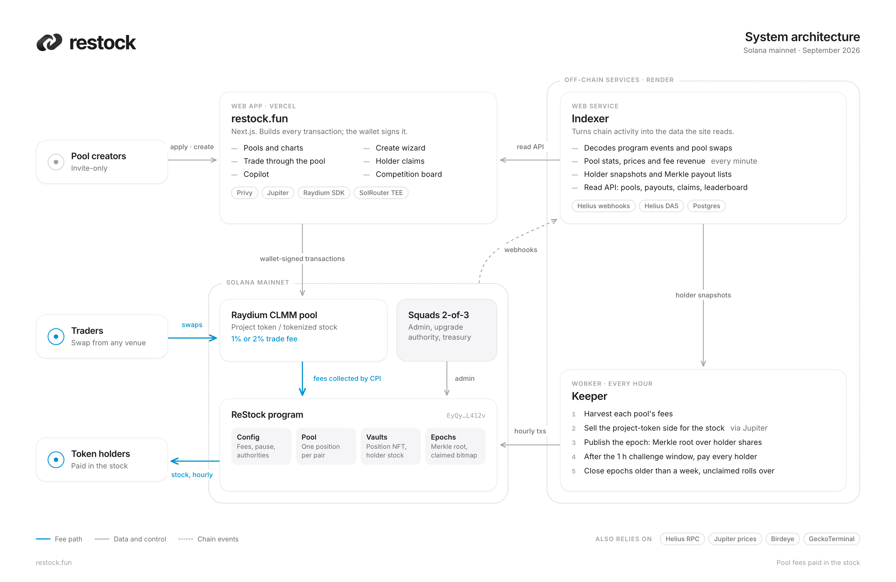

  <a href="https://restock.fun"><picture><source media="(prefers-color-scheme: dark)" srcset="assets/lockup-dark.png"></picture></a>

  Stock-paired liquidity for Solana tokens that already exist. Pool fees are paid to holders, in the stock.
   
  <a href="https://restock.fun">restock.fun</a> · <a href="https://x.com/restockfun">@restockfun</a> · <a href="https://restock.fun/docs">Docs on the site</a>

---

ReStock opens a Raydium or Meteora pool for an existing Solana token, quoted against a tokenized stock from
xStocks, Ondo, Backpack or PreStocks (NVDAx, TSLAon, GRND, OPENAI, …). Every swap in that pool pays a 1% or 2%
trade fee. Every hour, the fees are
harvested, converted entirely into the stock, and paid out to the token's holders straight into their wallets.

This repository holds the public documentation and architecture for ReStock. The program and services
themselves are closed source; everything they do on-chain can be checked independently, and
[Verify it yourself](docs/verify.md) shows how.

<picture>
  <source media="(prefers-color-scheme: dark)" srcset="assets/architecture-dark.png">
  
</picture>

## Documentation

| | |
|---|---|
| [How it works](docs/how-it-works.md) | Stocks, Raydium vs Meteora, pool lifecycle, lock modes, fees, hourly payouts |
| [Architecture](docs/architecture.md) | Each component, what it trusts, and which keys it holds |
| [Program reference](docs/program.md) | Accounts, instructions, events, invariants, the Merkle leaf format |
| [Verify it yourself](docs/verify.md) | Mainnet addresses and how to check pools, harvests and payouts on-chain |
| [Security](SECURITY.md) | Reporting a vulnerability, authorities, known risks |

## At a glance

| | |
|---|---|
| Network | Solana mainnet |
| Program | [`EyQygGKAxe9Py1MWfGM2KLPQ7FCQZ3RwncxSDiTL412v`](https://solscan.io/account/EyQygGKAxe9Py1MWfGM2KLPQ7FCQZ3RwncxSDiTL412v) |
| Upgrade authority and admin | Squads multisig vault [`7upasAXvUZHyCkXQC4CQoPZGVidbGCdGp9zX8svyoATq`](https://solscan.io/account/7upasAXvUZHyCkXQC4CQoPZGVidbGCdGp9zX8svyoATq) |
| AMMs | Raydium CLMM or Meteora DAMM v2, decided by the stock; 1% and 2% fees only |
| Stock issuers | xStocks (Backed), Ondo Global Markets, Backpack Securities, PreStocks |
| Payout cadence | Hourly, after a one-hour challenge window |
| Venue cut of each trade fee | Raydium 16% (12% protocol, 4% fund), Meteora 20%, kept by the venue before LPs are credited |
| Protocol share | 5% of the pool fees ReStock's position earns; holders get the other 95% |

## What this is not

Pool fees are trading fees paid by people who swap in the pool. They are not guaranteed, and holding a stock
token does not confer ownership of shares. Stock tokens are issued by third parties under their own terms,
which exclude some regions, including the United States.
