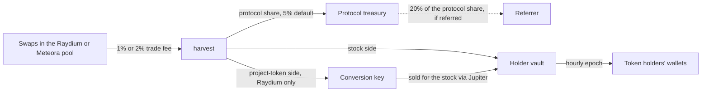

# How it works

[← Back](../README.md)

## The pair

A ReStock pool has a project token on one side and a tokenized stock on the other. The project token must
already exist; you do not need to be its creator to open a pool.

The stock comes from one of four issuers:

| Issuer | Symbols | Example |
|---|---|---|
| xStocks (Backed) | end in `x` | NVDAx, SPYx |
| Ondo Global Markets | end in `on` | TSLAon, AAPLon |
| Backpack Securities | plain tickers | GRND |
| PreStocks (pre-IPO private companies) | all-caps names | OPENAI, ANTHROPIC |

Only stock mints on the protocol's on-chain allowlist can be the quote side.

## Raydium or Meteora

The stock decides the venue; the creator does not choose it. Stock tokens are Token-2022 mints with extensions
(permanent delegate, pausable, transfer hook, …) that neither AMM accepts by default. Each keeps a per-mint
whitelist instead, Raydium's `SupportMintAssociated` and Meteora's `TokenBadge`, and the two lists barely overlap.
A stock whitelisted on only one venue opens there; one whitelisted on both opens on Raydium. A stock on neither
cannot be pooled yet, and the create wizard does not offer it.

For holders the two are the same: the same 1% or 2% trade fee, the same lock modes, the same hourly payout in the
stock. The differences are mechanical:

| | Raydium CLMM | Meteora DAMM v2 |
|---|---|---|
| Price range | Per position; full range by default, or a band | Per pool; set only when ReStock opens the pool, inherited if it already exists |
| Fees accrue in | Both tokens | The stock only, on pools ReStock opens (`collect_fee_mode = OnlyB`) |
| Conversion before payout | The project-token side is sold for the stock | None needed |
| Squads multisig flow | Yes (`create_pool_prepare` / `create_pool_execute`) | Not yet |
| Instructions | `create_pool`, `harvest`, `withdraw_position` | `create_pool_meteora`, `harvest_meteora`, `withdraw_position_meteora` |

When a Meteora pool for the pair already exists, `create_pool_meteora` refuses it if its fee collection mode or
fee schedule would stop holders being paid in the stock.

## Opening a pool

Pool creation is invite-only: apply on [restock.fun/create](https://restock.fun/create) with the wallet you will
use. Once approved, one transaction:

1. pays the 0.05 SOL creation fee,
2. creates the Raydium or Meteora pool if the pair does not have one yet, or checks the supplied price against it if it does,
3. opens the liquidity position, with its position NFT owned by a ReStock vault,
4. creates the pool's accounts and its holder vault.

The creator chooses the stock (which fixes the venue), the amounts, the price range (full range by default), the fee (1% or 2%),
the lock mode, and optionally a minimum holder balance and a cap on how many of the largest holders qualify.
The creator chooses nothing about where fees go.

Treasuries held in a Squads multisig use a two-step flow, on Raydium only for now: the operator wallet prepares the pool and pays the fee,
then the multisig funds the position in a vault transaction. The multisig becomes the position's owner.

### Starting price

The price comes from Jupiter's quote for one unit of each token, cross-checked against the deepest on-chain
pool read directly over RPC. If the two disagree by more than 3%, creation is refused until they agree. When a
Raydium pool already exists, the program itself rejects a supplied price more than ~3% from the pool's.

## Lock modes

| Mode | Where the position NFT sits | Can the liquidity leave? |
|---|---|---|
| **Locked** | Program vault `["lock", pool]` | No. The program has no instruction that transfers or closes this vault. The only venue calls it signs for the position collect fees: Raydium's with liquidity hardcoded to zero, Meteora's `claim_position_fee`. |
| **Unlocked** | Creator vault `["cvault", pool]` | Only by the creator, through `withdraw_position` (Raydium) or `withdraw_position_meteora`. The pool is then marked withdrawn and stops harvesting. |

Both are labelled on the pool page.

## Where the fees go

Holders receive every fee in the stock. A Raydium CLMM position earns fees in both tokens, so the project-token
side is converted; a Meteora pool opened by ReStock collects its fees in the stock alone, so that side is empty.

Each harvest splits both sides of the collected fees identically:

| Share | Amount |
|---|---|
| Protocol | `protocol_fee_bps` of the gross, 500 bps by default, at most 1,000 bps (enforced in the program) |
| Referrer | 20% of the protocol share, only for pools created through a referral link |
| Holders | Everything else |

The stock side of the holders' share stays in the pool's holder vault. The project-token side goes to the
protocol's conversion key, which sells it for the stock through Jupiter and deposits the stock into the same vault.
Nothing a holder receives needs to be sold on the project's own chart, and the pool creator keeps no share.

Anything sent directly to a pool's holder vault is paid out to holders in full at the next epoch, with no
protocol share: the program measures harvested fees as the vault's balance change across the venue's fee call,
so deposits are never counted as fees.

## Hourly payouts

Every hour, for every pool:

1. **Harvest.** Any key may call `harvest` (or `harvest_meteora`); the protocol's keeper does it for every pool
   that has accrued fees.
2. **Convert.** On Raydium pools, the project-token side is sold for the stock and added to the holder vault. Amounts worth less
   than about $1 wait for the next round.
3. **Snapshot and publish.** The indexer snapshots every holder of the project token, excluding the pool's own
   venue vault. It keeps holders at or above the pool's minimum balance, keeps only the largest N if the
   creator set a cap, and splits the vault's unreserved stock pro-rata by balance. The list is committed as a
   Merkle root in a new on-chain epoch, which reserves that amount in the vault. Epochs are skipped while the pot
   is under about $5, and are at least one hour apart (enforced in the program).
4. **Challenge window.** Claims open one hour after publication. Inside that hour the protocol admin (the
   multisig) can cancel a bad root, which releases its reservation.
5. **Pay.** Once the window passes, the keeper executes every leaf. The stock lands in each holder's own
   associated token account with nothing to sign. Holders can also claim themselves on the site. When a holder
   has no token account for the stock yet, the keeper waits until what they are owed across open epochs is worth
   more than the account rent (~$1).
6. **Close.** A week after claims open, or once an epoch is fully claimed or cancelled, anyone may close it.
   Unclaimed stock returns to the vault and rolls into the next epoch.

## Protocol economics

| | |
|---|---|
| Pool creation | 0.05 SOL (capped at 1 SOL in the program) |
| Protocol share of pool fees | 5% default, adjustable per pool by the admin up to 10% |
| Referrals | 20% of the protocol share from pools created through the referrer's link |
| Swaps through the site's Jupiter dialog | 0.5% site fee on top of Jupiter's |
| Trades through the site's pool trade dialog | No site fee; the pool's trade fee applies as normal |

## Copilot

[restock.fun/copilot](https://restock.fun/copilot) walks through the same settings as the create wizard, with preset
questions and answers, and accepts plain English ("half my WIF against Tesla, locked").

- Simple phrases are parsed on your device.
- Anything else is encrypted on our server to the public key of [SolRouter](https://solrouter.com)'s Intel TDX
  enclave, relayed blind, and answered inside the enclave by an open-weight model running on Nosana. The reply
  comes back encrypted.
- The model only chooses among the preset answers. It never picks a mint address and never writes the text you read.
- The result is handed to the wizard's review step, where you see the exact numbers before signing. Nothing is
  signed outside the wizard.

## Regions

Tokenized stocks are not available in some regions, including the United States. restock.fun gates access by the
visitor's country.
